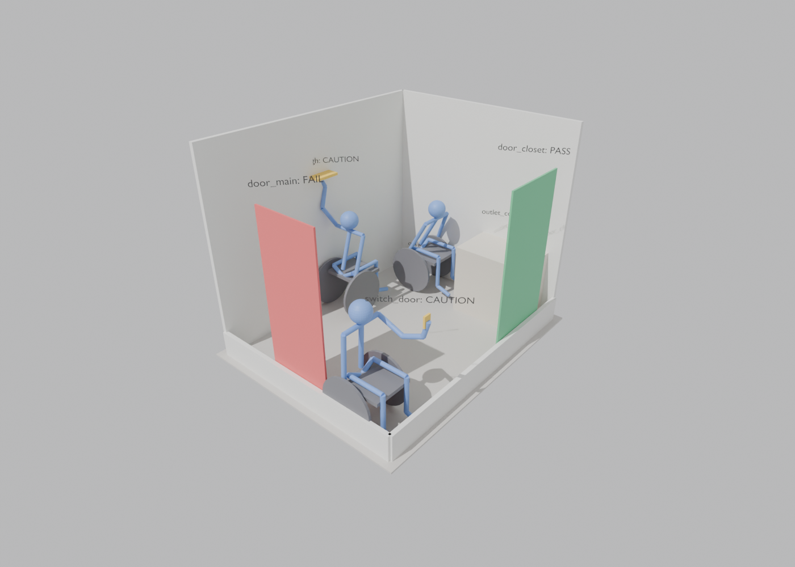

# AccessPath Verifier

Tests a floor plan against avatars of people with mobility and functional limitations, so you can check whether a design is actually usable before it's built. Can this person reach the outlet? Clear the doorway?

Each avatar is built from **joint cards** (baseline range of motion plus condition-specific overrides), not from one hand-made model per diagnosis. See [the build brief](docs/AccessPath_Verifier_Build_Brief.docx) for the design, and [the conventions](docs/conventions.md) for how its joint names, axes and angles map to the ISB and ISNCSCI standards when moving data to other software.

**[▶ Watch the 70-second demo video](docs/AccessPath_demo.mp4)**



*Test bathroom, profile `stroke_R_moderate_wheelchair`. Each fixture is colored by its result, and the avatar is posed in the reach the verifier found. The 30 in door fails the ADA 32 in minimum. The shelf and switch are reachable by this avatar but sit above seated shoulder height, so they get a CAUTION.*

## Where each step of the brief stands

| Step | Status | Where |
|---|---|---|
| 1. Baseline rig | Done. Blender skeleton with one bone per card joint, named to match the cards, baseline limits applied | `blender/rig.py`, `blender/build_rig.py` |
| 2. Card library | Done. The spreadsheet is the source of truth; editing one row changes the results, with no rig changes | `data/card_library.xlsx`, `accesspath/cards.py` |
| 3. Profile composer | Done. A profile name produces a constrained copy of the rig | `accesspath/profiles.py`, `blender/apply_profile.py` |
| 4. Envelope generation | Done for the arm chain (trunk lean, shoulder, elbow, wrist) using IKPy. Point cloud exports as `.ply` | `accesspath/kinematics.py` |
| 5. Task chain | Done. 4 tasks: outlet, light switch, shelf, doorway | `data/tasks.json` |
| 6. Floor-plan test | Done for a JSON room, viewable in Blender. **AutoCAD/DXF import is not built yet.** | `accesspath/verify.py`, `blender/show_results.py` |

The Blender skeleton and the IKPy reach chain are tested against each other: for the same joint angles they put the fingertip in the same place, to 0.1 mm.

## Results

| Result | Meaning |
|---|---|
| **PASS** | The avatar can do it, using only sourced or interpolated data |
| **CAUTION** | The avatar can do it, but a population statistic says many real people in this group can't (e.g. ~21% of wheelchair users can't reach above shoulder height) |
| **UNVERIFIED** | The avatar can do it only because able-bodied values stood in for data that isn't sourced yet. The real answer may be FAIL |
| **FAIL** | The avatar can't do it, even with able-bodied values standing in for missing data |

The verifier tries both arms and every approach the fixture allows (facing the wall, or side-on). Arms backed by real data are tried first. A stroke avatar whose affected arm has gaps can still PASS using the unaffected arm, and the result says which arm it used.

## Running it

Needs Python 3.10+.

```
pip install -e ".[test]"
python -m accesspath check-cards                      # check the spreadsheet, list what still needs a source
python -m accesspath verify                           # every profile x task in the test bathroom
python -m accesspath verify --profile kafo_L -o out/results.json
python -m accesspath compose stroke_R_moderate        # the joint limits a profile ends up with
python -m accesspath envelope stroke_R_severe --arm R -o out/envelope.ply
pytest                                                # 38 tests, ~30 s
```

### In Blender (tested with Blender 5.0)

```
python -m accesspath compose baseline_standing -o out/baseline_standing.json
python -m accesspath compose stroke_R_moderate_wheelchair -o out/stroke.json
python -m accesspath verify --profile stroke_R_moderate_wheelchair -o out/results.json

blender --background --python blender/build_rig.py -- --profile out/baseline_standing.json --out out/avatar.blend
blender out/avatar.blend --background --python blender/apply_profile.py -- --profile out/stroke.json
blender out/avatar.blend --python blender/show_results.py -- --room data/rooms/test_bathroom.json \
    --results out/results.json --profile stroke_R_moderate_wheelchair
```

Add `--render out/view.png` to the last command to save a still image like the one above. An imported `envelope.ply` lines up with the rig, since both use the same frame: metres, origin on the floor under the hip, +X right, +Y forward, +Z up.

## Moving data to other software

[docs/conventions.md](docs/conventions.md) maps the verifier's names and numbers onto two standards:
- **ISB joint-angle standard (Wu et al. 2005):** axes, signs and rotation order. OpenSim and motion capture use it.
- **ISNCSCI:** how clinicians describe a spinal cord injury.

In practice:
- Every card has an `ISB_term`.
- `accesspath.isb` converts positions and shoulder angles to the ISB frame.
- Spinal cord injury profiles are named the clinical way, e.g. `SCI_C6_AIS_A`.

## Editing the card library

Open `data/card_library.xlsx`. The **Field Definitions** sheet explains every column, and **Changes From Original** lists what changed from your first version.

- **To add a citation:** fill in the numbers and source, and set status to `sourced`. Then run `python -m accesspath check-cards`; it will say exactly which row is wrong if something doesn't fit.
- **To make a new profile:** add a row to the **Profiles** sheet listing the condition card_ids it uses.
- **Leave unsourced numbers empty,** not a dash.
- **`range_kind` tells the verifier how to read the numbers:**
  - Stroke scoring bands (`score_band`) use the band's lower edge, so the design has to work for everyone in the band.
  - Task thresholds (`task_threshold`) are recorded but never applied as a joint limit.

## Assumptions to confirm

These are in `data/body.json` and the card library, each marked with where it came from:

- **Body size:**
  - 1.70 m avatar, segment lengths from Drillis & Contini ratios
  - wheelchair hip height 0.57 m
  - seated forward trunk lean capped at 30°
- **Approach distances:** how close the avatar gets to the wall. Standing forward 0.20 m, wheelchair forward 0.60 m (footrests at the wall, no knee space under counters), wheelchair side 0.33 m.
- **Shoulder extension 0–60° and trunk flexion 0–80°:** added from AAOS ranges and marked `interpolated`, since the arm chain needs them.
- **Doorway width with no mobility aid:** shoulder width + 5 cm each side (interpolated).
- **Reach point:** a reach counts when the fingertip touches the target. Legs aren't used, so there's no squatting or stepping.

## Not built yet

- **AutoCAD/DXF room import.** Rooms are JSON for now (`data/rooms/test_bathroom.json`).
- **Leg-chain envelopes.** The doorway check uses a width, not a swept leg.
- **Hand/finger cards.**
- **Using the `strength`, `control` and `dependency_flags` columns.** They're recorded but don't change results yet.
- **Shoulder rotation and forearm pronation/supination cards.**

## Demo video

`video/` builds a ~75 s demo video from real verifier output (no audio; it's meant to be talked over):

```
python -m accesspath verify --profile stroke_R_moderate_wheelchair --profile stroke_R_severe -o out/results.json
python3 video/blender_clip.py -- --blend out/avatar.blend --results out/results.json \
    --profile stroke_R_moderate_wheelchair --out out/frames/clip_ --frames 96
python3 video/make_video.py --clip out/frames/clip_ --out out/AccessPath_demo.mp4
```

Needs `pip install bpy matplotlib pillow imageio-ffmpeg`, and `out/avatar.blend` with the profile's rig (see "In Blender" above).
